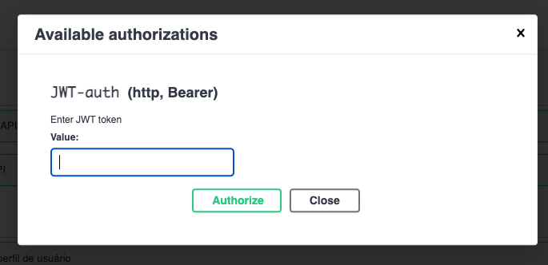

# Webservice RestFull FIAP
#### API desenvolvida para atividade Desafio: WebServices em RESTful da FIAP

Este projeto contempla um MVP contendo:

- Cadastro de usuários
  - Perfil
  - Habilidades
  - Cursos
- Empresas
- Oportunidades de Emprego

********
## Como acessar?

Url de Acesso: 
> webservice-restful-fiap.costacruzsilva.dev.br/api

Esta interface da acesso ao swagger onde será possível verificar todos os endpoints e interagir com os mesmos.

### Usuário para autenticacão
> usuario: fiap
> senha: fiap

* Após autenticar com este usuário basta copiar o token e clicar no botão **Authorize**  e preencher o campo com o token obtido (Isto deve ser executado para acesso as rotas bloquedas)

********
## Tecnologias
NestJs
Swagger
PostgreSql
Docker

